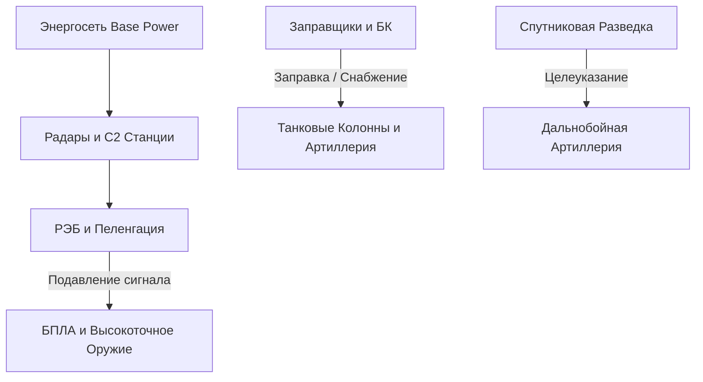

# Архитектура и Концепция: Современная браузерная RTS 2040 (3-Tier Faction & Logistics Architecture)

## 1. Стратегическая валидация концепции

Сдвиг от прямого клонирования Red Alert к **аркадной глобальной RTS в сеттинге вымышленного кризиса 2035–2045 годов** решает главную проблему веб-разработки RTS: **проблему комбинаторного взрыва контента и баланса**.

### Сравнение подходов

| Параметр | 17 Уникальных Фракций (Монолит) | 3-Уровневая Модульная Система |
| :--- | :--- | :--- |
| **Количество юнитов** | 400–500 уникальных 3D-моделей | 60–80 базовых платформ + наборы обвесов/скинов |
| **Балансировочные пары** | \(\frac{17 \times 16}{2} = 136\) пар фракций | 6–8 базовых архитектур (\(\le 28\) пар) |
| **Озвучка и локализация** | 17 уникальных языковых актеров | Разделение: 6 типов команд + 17 наборов национальных реплик |
| **Поддержка и DLC** | Невозможно добавлять новые страны | Новая страна = visual pack + 1–2 уникальных командира |

---

## 2. Трехуровневая архитектура фракций

Игрок перед матчем (или в режиме генерала) формирует свою боевую группу из трёх составляющих:

```
┌───────────────────────────────────────────────────────────┐
│                       1. NATION                           │
│  (Визуальный стиль, Нация, Озвучка, Герой, Музыка, UI)    │
└─────────────┬─────────────────────────────────────────────┘
              │
              ▼
┌───────────────────────────────────────────────────────────┐
│                    2. BASE DOCTRINE                       │
│  (6-8 базовых архитектур: Дерево Тек, Здания, Движок)    │
└─────────────┬─────────────────────────────────────────────┘
              │
              ▼
┌───────────────────────────────────────────────────────────┐
│                     3. COMMANDER                          │
│  (Специализация, T3-юниты, Пассивки, Командные Абилки)   │
└───────────────────────────────────────────────────────────┘
```

### 2.1. Базовые Военные Архитектуры (Base Doctrines)

Вместо 17 уникальных фракций в `packages/sim-core` реализуется всего **6 базовых технологических древов**:

1. **Eastern Heavy Echelon (Тяжёлая сухопутная архитектура)**
   - *Фокус*: Высокий запас брони, эшелонированная артиллерия, мощные тяжелые ПВО, статичные укрепрайоны.
   - *Базовые страны*: Россия, Индия.
2. **Western Precision Network (Сетецентрическая архитектура высокоточного оружия)**
   - *Фокус*: Авиаудары, дроны-пеленгаторы, спутниковое целеуказание, высокий урон на дальних дистанциях, дороговизна.
   - *Базовые страны*: США, Великобритания.
3. **Asian Industrial Mass (Массовая промышленность и роевые системы)**
   - *Фокус*: Дешевое и быстрое строительство, конвейерное производство, микро-дроны, ракетные залпы.
   - *Базовые страны*: Китай, Южная Корея.
4. **Combined Expeditionary & Maritime (Морская и десантная архитектура)**
   - *Фокус*: Мобильные плавучие/амфибийные базы, катера, вертикальный взлет (VTOL), контроль водных артерий.
   - *Базовые страны*: ЕС (Франция/Италия), Индонезия.
5. **Mobile Raiding & Wheeled Warfare (Мобильно-рейдовая архитектура)**
   - *Фокус*: Колёсная техника, высокая скорость маневра, маскировка, противотанковые западни.
   - *Базовые страны*: Украина, Бразилия, Южная Африка.
6. **High-Tech Defense & Cyber Brokerage (Оборонительно-финансовая архитектура)**
   - *Фокус*: Автономные турели, подземные бункеры, кибератаки, торговые узлы и перехват ресурсов.
   - *Базовые страны*: Япония, Швейцария.

---

## 3. Механики современной военной логистики и РЭБ

Чтобы игра ощущалась современным военным конфликтом, а не ретро-клоном, вводятся 4 взаимосвязанных логистических контура.



### 3.1. Контур Связи C2 и РЭБ (Command & Control / Electronic Warfare)
- **C2 Покрытие**: Автономная техника и дроны требуют устойчивого сигнала от C2-вышек или мобильных штабов. При выходе за радиус C2 урон и скорость БПЛА снижаются на 50%.
- **РЭБ Купол (EW Jamming)**: Генераторы помех создают сферу подавления. В зоне РЭБ:
  - Дроны теряют управление и падают/возвращаются на базу;
  - Самоуправляемые ракеты сбиваются с курса;
  - Миникарта противника в этой зоне покрывается «шумом».

### 3.2. Контур Топлива и Боеприпасов (Fuel & Ammo Logistics)
- **Топливный Баланс**: Тяжёлая техника расходует топливо при передвижении.
  - Формула расхода: \( \text{Fuel}_{\text{current}} = \text{Fuel}_{\text{max}} - \int (v_{\text{move}} \cdot k_{\text{terrain}}) \, dt \).
  - При 0% топлива юнит теряет скорость на 80% (работает только аварийный двигатель).
- **Машины Снабжения (Supply Trucks / Heavy Resupply Helicopters)**: Автоматически заправляют и пополняют БК юнитов в радиусе ауры снабжения.

### 3.3. Визуальная прозрачность (No Spreadsheet UI)
- Юнит без топлива -> над ним появляется мигающий amber-значок канистры, а из выхлопной трубы идёт белый дым попыток завестись.
- Юнит под РЭБ -> иконка «No Signal», цифровой помеховый эффект на 3D-модели.
- Поврежденный аэродром -> взлётная полоса дымит, время перезарядки самолётов увеличивается в 3 раза.

---

## 4. Проектирование TypeScript / Data Assets Schema

Ниже представлена архитектура DTO и Zod-схем в `packages/content-schema` для поддержки 3-уровневой системы.

```typescript
// packages/shared-types/src/doctrine.ts

export enum BaseDoctrineId {
  EASTERN_HEAVY = 'EASTERN_HEAVY',
  WESTERN_PRECISION = 'WESTERN_PRECISION',
  ASIAN_INDUSTRIAL = 'ASIAN_INDUSTRIAL',
  EXPEDITIONARY_MARITIME = 'EXPEDITIONARY_MARITIME',
  MOBILE_RAIDING = 'MOBILE_RAIDING',
  HIGH_TECH_CYBER = 'HIGH_TECH_CYBER',
}

export interface DoctrineDefinition {
  id: BaseDoctrineId;
  name: string;
  description: string;
  baseBuildingIds: string[];
  baseUnitIds: string[];
  techTreeStructure: TechNode[];
}

export interface NationDefinition {
  id: string;
  name: string;
  flagIcon: string;
  defaultDoctrineId: BaseDoctrineId;
  skinPaletteId: string;
  voiceSetId: string;
  heroUnitId?: string;
  nationalBonus: {
    description: string;
    statModifiers: Record<string, number>;
  };
}

export interface CommanderDefinition {
  id: string;
  nationId: string;
  name: string;
  title: string;
  avatarUrl: string;
  unlockedUnitIds: string[];
  passiveTraits: PassiveTrait[];
  activeCallIns: CommanderPower[];
}
```

---

## 5. Дорожная карта интеграции в Monorepo

1. **Фаза 1: Рефакторинг `content-schema` и `content-runtime`**
   - Перевести ростер с монолитных фракций (`SU`, `AL`, `EC`, `CL`) на композиционную модель `Nation` + `Doctrine` + `Commander`.
2. **Фаза 2: Реализация систем РЭБ и Снабжения в `sim-core`**
   - Добавить `SupplySystem` и `SignalGridSystem` в fixed-step симулятор (30Hz).
3. **Фаза 3: Визуализация и React HUD**
   - Добавить в React UI индикаторы топлива, радиуса C2 и генераторов помех.
   - Интегрировать экраны выбора страны и командира в лобби перед матчем.
